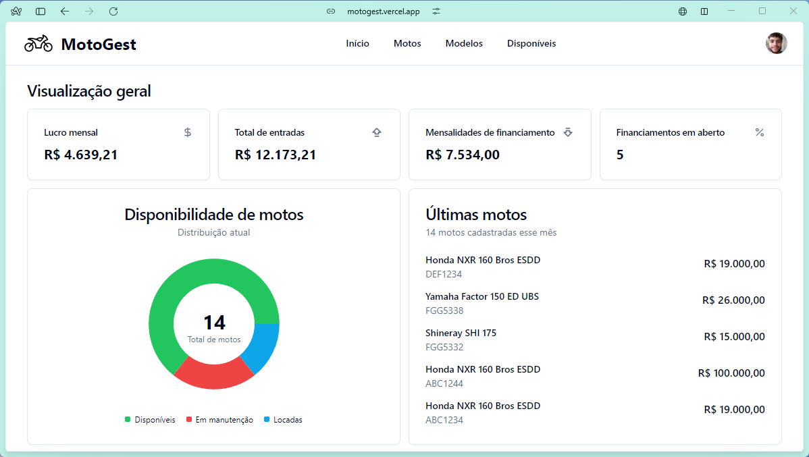

# <a href="https://motogest.vercel.app" target="_blank"> MotoGest </a>

É uma aplicação web desenvolvida para facilitar a gestão de locadores de motos, oferecendo uma interface intuitiva e moderna para visualizar, adicionar e gerenciar informações sobre motocicletas, a fim de suprir as necessidades desse nicho de mercado.

Conta também com uma área pública, para que clientes possam verificar quais modelos se encontram disponíveis para locação no momento e entrem em contato via whatsapp de forma facilitada.

Ela já se encontra disponível <a href="https://motogest.vercel.app" target="_blank"> aqui</a>. Para entrar na área privada, basta utilizar o email e senha já disponibilizados ou acessar por meio de sua conta do google.

## 🔧 Tecnologias/ferramentas utilizadas

- Typescript
- React.js
- Zod
- Shadcn/UI
- Tailwind
- Supabase
- Vercel

## Aprendizados
Nesse projeto pude aplicar diversos conhecimentos, como: 
- Utilizar Remote Procedure Calls (RPC) para criar funções personalizadas PostgreSQL e otimizar a performance das querys realizadas
- Integrar o sistema de login do Supabase com o React, permitindo que usuários possam entrar no sistema de forma segura e criptografada
- Adicionar possibilidade do usuário fazer login com autenticação externa, utilizando sua conta Google
- Criar dashboard de gerenciamento, com diversos gráficos e informações pertinentes ao negócio